# TODO TOGETHER (ALONE at HOME)
1. Rileggere Mobile Clip
	1. obiettivi
	2. intro a cosa hanno introdotto
		1. reinforce data
		2. multi-model reinforced training (loss)
		3. hybrid text encoder (Text-Rep Mixer)
		4. hybrid image encoder (Fast Vit Inspired)
	3. risultati e specifiche (hw, latency, dataset, architettura, training time, storage size)
2. Possibili migliorie
	1. dataset reinforce
		1. https://arxiv.org/abs/2405.11919 -> idea di ettore, dataset caption intelligent reduction wrt estimated quality wrt generated captions -> objective to reduce the training time and potentially (small gain) in accuracy.
		2. PruMer (towards the dataset creation)-> 
			1. velocizzare la creazione del dataset rinforzato
	2. loss 
		1. implementare tinyClip -> obiettivo di ridurre ancora piu' il modello -> less latency, less training time
		2. Mostrare comparison tra risultati Mobile e Tiny: accuracy, dimensioni modello, training time
		3. Possibile implementazione di Patch Ranking per fare pruning sul ViT come sostituto alla sparsity(idea)
	3. inference
		1. prumer (towards model efficiency)
			1. rendere il modello piu' veloce (forse occupa meno vram? da vedere)
	4. architecture (?)
		1. Sigmoid Self-Attention -> NotebookLM salvaci tu
-----------------------------------------
# 1 - MobileClip

## Objective
Design a new family of aligned image-text encoders suitable for **mobile devices**.
They need to be small and performant, accuracy improvement is a bonus.

Things to keep in mind:
1. **Tradeoff between runtime performance and accuracy of different architectures.**
	- Large scale training of CLIP is computationally expensive, so rapid development and exploration of efficient architecture designs is hard $\rightarrow$ better training efficiency
	- Standard multi-model contrastive learning [47] at small-scale results in poor accuracies, which doesn't provide a useful signal to guide architecture design choices. 
2. **Reduced capability of smaller models.**
	- Smaller models have reduced capability to capture the complex relationships between images and text, which results in poor performance.
	- Can be improved with a better training method.

## Proposed Solution (Summary)
1. **Multi-model variant of dataset reinforcement for training efficient CLIP models.**
	- Reinfoced dataset
	- Training architecture (loss)
2. **Model Design**
	- Hybrid Text Encoder - Text-RepMixer
		- RepMixer based
	- Hybrid Image Encoder - MCi
		- FastViT based

A new family of mobile-friendly CLIP models, MobileCLIP, is proposed. They use hybrid CNN-transformer architectures with structural reparametrization in image and text encoders to **reduce the size and latency**.

Introduced methods:
- Multi-modal reinforced training, a novel training strategy that incorporates knowledge transfer from a pre-trained image captioning model and an ensemble of strong CLIP models to improve learning efficiency.
- Two reinforced datasets	
- MobileCLIP family obtains state-of-the-art latency-accuracy tradeoff on zero-shot tasks, including marking a new best ViT-B/16 based CLIP model.

## Data - Dataset Reinforcement
TODO: ordinare

The idea is to:
1. Reinforce a dataset once with additional information.
2. Use the reinforced dataset several times for experimentation.

Based on DataComp, by adding **synthetic caption** and embeddings from a **strong ensemble** of pretrained CLIP models **See table 14**, both based on `ViT-L-14`:
- teacher 1: `openai-ViT-L-14`
- teacher 2: `datacomp_xl_s13b_b90k-ViT-L-14`

Generated datasets:
- **DataCompDR-12M**: rapid iteration on efficient model design.
- **DataCompDR-1B**: large-scale training performance.

- Using Data-CompDR, we demonstrate 10x-1000x learning efficiency in comparison to DataComp.
- For a given compute budget, training with the reinforced dataset results in improved accuracy compared to the original dataset.
- This makes the training process more efficient and the model more resilient to noise in the data.
- Synthetic captions are crucial for improved learning efficiency.
- Dataset Reinforcement Stratefy extended to the multi-modal setup of CLIP. Accuracy improvement without adding training-time computational overhead.

- Store the additional knowledge (synthetic captions, teacher embeddings, image augmentation parameters, feature embeddings of the clip teachers, original image and caption) in the reinforced dataset.

### Synthetic captions - Aka Caption Augmentation
#### Motivation
Image-text datasets used to train CLIP models are mostly sourced from the web, which is noisy. DataComp [18] and data filtering networks [16] improved the quality, but captions may not be descriptive enough.

#### Idea
Boost the visual descriptiveness of caption using CoCa [74] (`coca_ViT-L-14`) to generate multiple synthetic captions for each image $\rightarrow$ real captions wrt synthetic captions are generally more specific but noisier.

### Image Augmentation
For each image $x_{img}^{(i)}$, generate multiple augmented images $\hat{x}_{img}^{(i)}$ using a parmetrized augmentation function $\mathcal{A}$:

$$\hat{x}_{img}^{(i,j)} = \mathcal{A}(x_{img}^{(i)}; a^{(i,j)})$$

where $a^{(i,j)}$ are the augmentation parameters that are sufficient to reproduce $\hat{x}_{img}^{(i)}$ from $x_{img}^{(i)}$. 
The number and different kind of augmentations are provided in **Tab 4a and Tab 13**. 

$\mathcal{A} is a strong random image augmentation (Random-Resize-Crop (RRC), RandAugment (RA), RangeAugment (only for the student while training)).

TODO: where does this comes from? Probably it's the `#` of augmentations. 

- `DataCompDR-12M`: $30$
- `DataCompDR-1B`: $10$

### Reinforced Dataset
We store the image augmentation parameters a (i,j) , synthetic captions $x^{(i,s)}_{syn}$ , feature embeddings  $\psi^{(i,j,k)}_{img}$ , $\psi^{(i,s,k)}_{syn}$ and $\psi^{(i,k)}_{txt}$ of the CLIP teachers as additional knowledge in the dataset along with the original image $x^{(i)}_{img}$ and caption $x^{(i)}_{txt}$ (see Fig. 3c).

## Training - Multi-Model Reinforced Training
Novel training strategy that incorporates knowledge transfer from a pre-trained image captioning model and an ensemble of strong CLIP models to improve learning efficiency.

### **Knowledge transfer**:
1. knowledge of an image captioning model via **synthetic captions**
2. knowledge distillation of image-text alignments from an ensemble of strong pretrained CLIP models **through the dataset reinforcement** strategy.

### Loss Function

$$\mathcal{L}_{Total}(\mathcal{B}) = (1-\lambda) \mathcal{L}_{Distill}(\mathcal{B}) + \lambda \mathcal{L}_{Distill}(\mathcal{B})$$

$$\mathcal{L}_{Distill}(\mathcal{B}) = \frac{1}{2} \mathcal{L}^{I2T}_{Distill}(\mathcal{B}) + \frac{1}{2}\mathcal{L}^{T2I}_{Distill}(\mathcal{B})$$
$$\mathcal{L}_{Distill}^{I2T} = \frac{1}{bK} \sum_{k=1}^{K}KL(\mathcal{S}_{\tau_k}(\Psi^{(k)}_{img}, \Psi^{(k)}_{txt}) || \mathcal{S}_{\hat(\tau)}(\Phi_{img}, \Phi_{txt}))$$

where:
- $KL$ is the Kullback-Leibler divergence
- $\tau$ is the temperature
- $\lambda$ is a tradeoff parameter
- $\mathcal{L}_{Distill}^{T2I}$ is computed by swalpping the text and imageembedding terms of $\mathcal{L}_{Distill}^{I2T}$

### Efficient Training
For every sample, we read the image $x_{img}^{(i)}$ and the corresponding ground-truth caption $x^{(i)}_{txt}$ form the dataset.
Then we randomly load one of stored augmentation parameters $a^{(i,j)}$ and reproduce the augmented image $\hat{x}^{(i,j)}_{img}$ . We also randomly load one of synthetic captions $x_{syn}^{(i,s)}$. Finally we read the stored embeddings $\psi_{img}^{(i,j,k)}$, $\psi_{syn}^{(i,s,k)}$ and $\psi_{txt}^{(i,k)}$, corresponding to the *K* teacher models.
Using this data we construct two data batches:
- $\mathcal{B}_{real}$ augmented image, real caption pairs
- $\mathcal{B}_{syn}$ augmented image, synthetic caption pairs
and compute our trainig loss separately on both. The final loss is:
$$\sum_{\mathcal{B} \in \{\mathcal{B}_{real}, \mathcal{B}_{syn}\}} \mathcal{L}_{Total}(\mathcal{B})$$
Note that we can compute the total loss after a forward pass of the student model without any extra teacher related computations since the teacher embeddings required to compute the distillation loss are readily available as part of the dataset.

### Ensemble Teacher
Model ensembling is used to create a stronger model from a set of indipendently trained ones [33,46]. We extend this technique to multi-model setup and use an ensemble of *K* CLIP models as a strong teacher.

We compute the feature embeddings of these models for augmented images $\hat{x}^{(i,j)}_{img}$ and synthetic captions $x^{(i,s)}_{syn}$ obtaining $d_k$-dimensional vectors $\psi^{(i,j,k)}_{img}$ and $\psi^{(i,s,k)}_{syn}$ for the $k_{th}$ teacher model. We also compute the teacher embeddings $\psi^{(i,k)}_{txt}$ of the ground-truth captions $x^{(i)}_{txt}$ (see Fig. 3b).

## Architecture
Variants of MobileCLIP use hybrid CNN/transformer architectures with **structural reparametrization in image and text encoders** to reduce the size and latency.  

### Hyrid Text Encoder - Text-RepMixer
In classic CLIP is paired the vision transformer with a classical transformer with self-attention layers for text encoding, this works well but it's not efficient.
<!-- - Recent work [67] showed that **convolutions can be as effective for text encoding** but we found that purely convolutional architectures underperform their transformer counterparts. -->
We introduce a **hybrid text encoder(Conv/Transf) which makes use of 1-D convolutions and self-attention layers**: *Text-RepMixer* which decouples train-time and inference-time architectures. Inspired by reparametrizable convolutional token mixing (RepMixer, introduced in [62]). More in the paper and **Appendix F**.

**TL:DR** replae convolution with self-attention. This encoder is smaller, faster and with similar performance as the text encoder of ViT-S/16.

#### Text-RepMixer vs RepMixer
*Text-RepMixer*

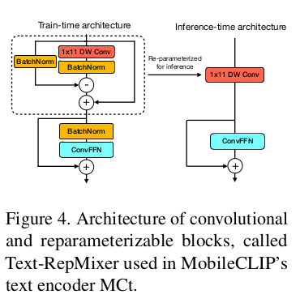 

*RepMixer*

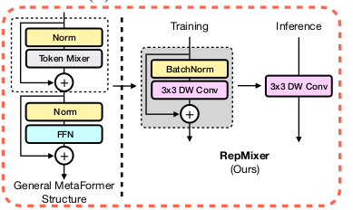

RepMixer, a fully reparameterizable token mixer that uses structural reparameterization to remove the skip-connections. It also uses depthwise convolutions for spatial mixing of information. It can be reparameterized at infirence to remove any branches.

- structural reparametrization
	- arXiv:1704.04861, 2017
	- introduce factorixed $k \times k$ convolution using depthwise or grouped convolutions followed by $1 \times 1$ pointwise convolutions.
	- improves efficienct, but lower parameter count can lead to reduced capacity.
	- use $k \times k$ convolutions and boost capacity of these layers using linear train-time overparametrization.

- used to remove skip connections and linear overparametrization

#### How does reparametrization works? 

#### Hybrid Implementation
TODO: where is this in the paper?
1. Ablation on the convolutional text encoder with 6-layers, 11 size kernel was the best tradeoff
2. Use depth-wise 2D convolutional layers(for efficency)
3. Reshaping of the 3d input tensor in to the *BC1S* standard
4. "The FFN layers enable interactions between token's channel dimensions. Since the convolution layer is 2D, we simply reuse the reparameterization process described in [62]"

#### FastVit
FastViT is a hybrid transformer and has **4 distinct stages** which operate at different scales, plus a stem head for processing raw embeddings of the input.

The main introductions were:
1. use of RepMixer block to remove skip connections
2. use of linear train-time overparameterization to improve accuracy
3. use of large convolutional kernels to substitute self-attention layers in early stages
   
The first 3 are the same stacked on top of each other, with no attention mechanism but RepMixer as token mixing component which is faster and emulates the behavior of a classic ViT.
While in the forth is done the CPE (which will be overparametrize in the training) and there is the attention mechanism.

**CPE:** *Conditional Positional Encoding* which instead of relying on fixed positional vectors, CPEs adjust the positional encoding vectors in response to the specific context of the input, enabling more flexible and context-aware representations.

**RepMixer:** Is a **convolutional mixing**(not with self attention like classical token mixing) that differentiate between training and inference time by doing:
- *Training*: a simple DepthWise Convolution  with BN and skip connection
- *Inference*: they leave skip connection and everything is represented just with a DepthWise Convolution which incorporate the previous skip. This is called **structural reparameterization**

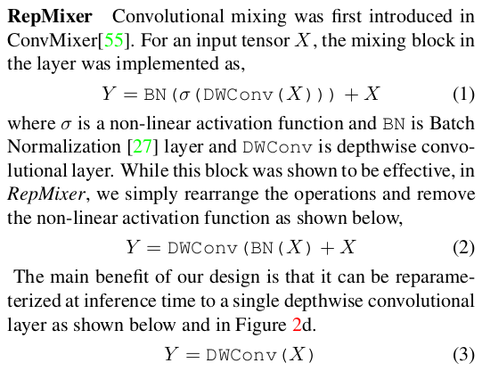 

*Stage 1-2-3* $\rightarrow$ *Stage 4* $\rightarrow$ *ConvFFN*

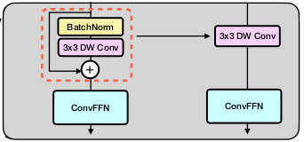 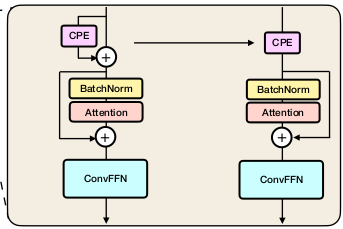 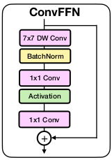

#### Structural Reparametrization
This technique consist to have different architectures between train and inference time, removing all the skip connections and having a much simpler structure at inference time permits to keep the knowledge from the specific block while reducing notably the latency during inference.

This is done in this specific case collapsing every skip connection and every other operations in a single depth wise convolutional block.

*From RepMobile*

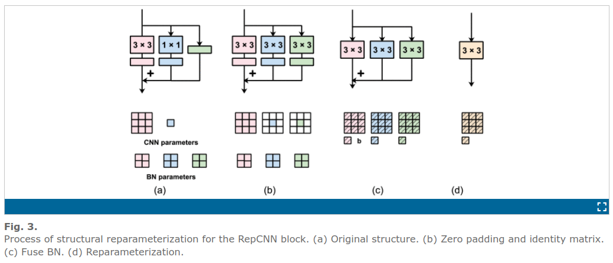

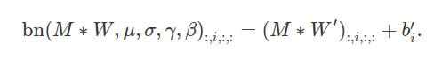

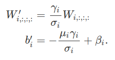

NOTE: EXAMPLE WITH FASTVIT!

The output of the RepMixer block during training is:
$$y = \texttt{BN}(W_{dw}x + W_{sum}x)$$

where $W_{dw}$ is the depthwise convolutional kernel, $W_{sum}$ is the linear overparametrization, and $x$ is the input to the block.  This is equivalent to the sum, 3x3 depth wise (DW) convolution and batchnorm.

We need to reparametrize it to a 3x3 DW convolution kernel.

We get:
$$ W_{combined} = W_{dw} + W_{sum} $$

During training consider that BatchNorm applies this transformation:

$$ y = \gamma \frac{W_{combined}x -\mu}{\sigma} + \beta$$

We rewrite this as a modified convolutionn operation by definining new weights and bias:

$$ W_{rep} = \gamma \frac{W_{combined}}{\sigma} $$

$$ b_{rep} = \beta - \gamma \frac{\mu}{\sigma}$$

The output of the RepMixer block during **inference** is:
$$y = \texttt{BN}(W_{rep}x + b_{rep})$$
- $W_{rep}$ is the reparametrized 3x3 depthwise convolution kernel
- $b_{rep}$ is the reparametrized bias that accounts for batch norm.

##### Convolutional Token Mixing
Inside a transformer, instead of using a classical self attention mechanism during the token mixing part, it has been shown that similar results could be achieved especially in the first blocks of the transformer using the convolutional counter part but speeding up latency and training wise.

TextRep-Mixer is an example of that.

### Hybrid Image Encoder
For Mobile-CLIP we introduce an improved hybrid vision transformer called MCi based on the recent FastViT [62].
To improve parameter efficiency we lower the expansion ration to 3.0 and increase the depth of the architecture. 
TODO: More in Appendix A and Appendix B.

We find that this design has a minimal impact on latency, but a good improvement in capacity of the model, reflected in the downstream task performance.

> // Infos about FastVit in `Mobile Clip.md`

## Results
Hw, latency, dataset, architecture, training time, storage size

*Our MobileCLIP-S2 variant is **2.3× faster while more accurate** compared to previous best CLIP model based on ViT-B/16.*

*We further demonstrate the effectiveness of our multi-modal reinforced training by training a CLIP model based on ViT-B/16 image backbone and achieving **+2.9% average performance improvement on 38 evaluation benchmarks compared to the previous best.** Moreover, we show that the proposed approach achieves **10×-1000× improved learning efficiency** when **compared with non-reinforced** CLIP training.*

So:
1. better avg. accuracy on 38 benchmarks
2. improved learning efficency

### Dataset
with a single node 8xA100 61.7% zero-shot on ImageNet-val, with ViT-B/16 trained on DataCompDR-12M. In $~1$ day.

Appendix G: Performance of other models on DataCompDR-12M - Tab. 19.

### Model
MobileCLIP-S0: 5x faster, 3x smaller than OpenAI ViT-B/16 CLIP, same average accuracy.

### Text-RepMixer

### MCi
In Tab. 1, we compare our MCi encoder with a similar sized FastViT-MA36 when used as image encoders in a CLIP model. Our model ob- tains much better zero-shot IN-val performance while being 16.3% faster.

#### 3.1.1 Latency
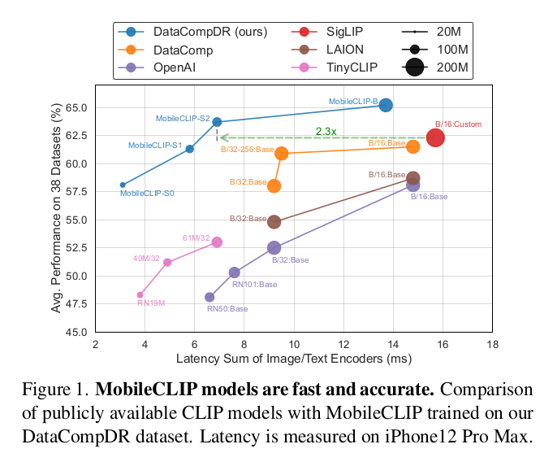
#### 3.1.2 Accuracy
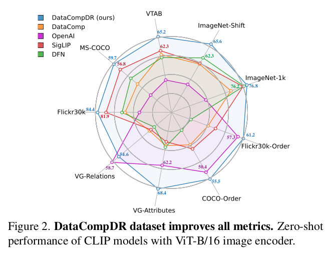
### 3.2 Test

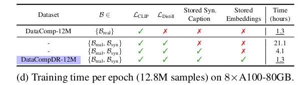

On *DataCompDR-12M*:

- **With the stored embeddings ==> 4.1 hours**
- **Without the stored embeddings ==> 1.3 hours**

# 2 - Improvements

### 2.1 Dataset Reinforcement

### 2.2 TinyCLIP on MobileClip - Loss integration

**2.2.1 CLIP & MobileCLIP**

We know that std. **CLIP loss** is:

$$
\mathcal{L} = -\frac{1}{2N} \sum_{i=1}^{N} \Bigg[
\log \frac{\exp\bigl(\mathrm{sim}(x_{i}, y_{i}) / \tau\bigr)}
{\sum_{j=1}^N \exp\bigl(\mathrm{sim}(x_{i}, y_{j}) / \tau\bigr)}
\;+\;
\log \frac{\exp\bigl(\mathrm{sim}(x_{i}, y_{i}) / \tau\bigr)}
{\sum_{j=1}^N \exp\bigl(\mathrm{sim}(x_{j}, y_{i}) / \tau\bigr)}
\Bigg],

$$

Where is in the first contrastive loss from text to image and the second is viceversa

MobileClip loss is:

$$

\mathcal{L}_{\text{Total}}(\mathcal{B}) 
= (1 - \lambda)\,\mathcal{L}_{\text{CLIP}}(\mathcal{B})
  + \lambda\,\mathcal{L}_{\text{Distill}}(\mathcal{B}),\\

\mathcal{L}_{\text{Distill}}(\mathcal{B})
= \tfrac{1}{2}\,\mathcal{L}_{\text{I2T Distill}}(\mathcal{B})
  + \tfrac{1}{2}\,\mathcal{L}_{\text{T2I Distill}}(\mathcal{B}),\\

\mathcal{L}_{\text{I2T Distill}}(\mathcal{B})
= \frac{1}{bK}
  \sum_{k=1}^{K}
  \mathrm{KL}\Bigl(
      S_{\tau_k}\bigl(\Psi_{\mathrm{img}}^{(k)}, \Psi_{\mathrm{txt}}^{(k)}\bigr)
      \,\Big\|\,
      S_{\hat{\tau}}\bigl(\Phi_{\mathrm{img}}, \Phi_{\mathrm{txt}}\bigr)
  \Bigr).
$$

Which has the std. CLIP loss and the Distill loss parametrized by $\lambda$ which empowers the stored embeddings a lot (0.7-1.0), as shown in the figure below

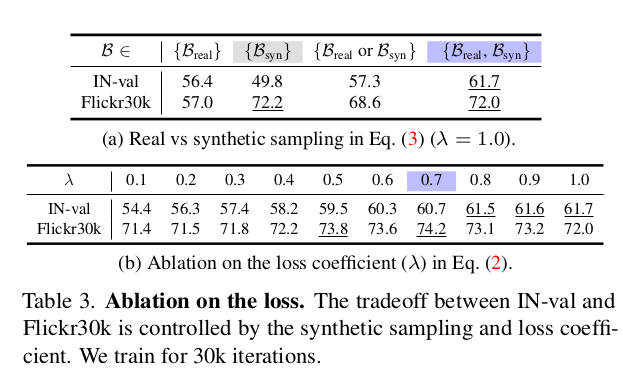

**TinyClip contributions**

**2.2.2 Affinity Mimicking**
This is the technique (introduced by a loss) that mixed the embeddings from the teacher and the student model, using the classic contrastive loss between both the Text2Image and viceversa among the teacher and the student

$$
L_{distill} = L_{I2T} + L_{T2I}\\
L_{I2T} = CE(A^{s}_{I2T}, A^{t}_{I2T})\\
A_{I2T}(i,j) = \frac{exp(I_{i} * T_{j}/ \tau)} {\sum_{k \epsilon \Beta}exp(I_{i} * T_{k}\tau)}
$$

**2.2.3 Weight Inheritance - Manual and Automatic**
*"To capture the importance of weights in a fine-grained level, we introduce two mask variables $m_{head}$ , $m_{int}$ ∈ {0, 1} to identify the redundant attention heads in MHA and neurons in FFN respectively, while keeping the important ones. These two kinds of masks are imposed on the activation of attention heads and the intermediate layer of FFN"*

1. $m_{head}^{h}$ *with* $h = (1 .. N_{H})$
2. $m_{int}$ *one for each FFN*
   
*"Moreover, to further learn the importance of embedding dimensions in transformer, we introduce an additional mask m embed ∈ {0, 1}. This mask is shared across all layers because each dimension in the hidden representation is connected to the corresponding dimension in the subsequent layer through a residual connection."*

1. $m_{embed} \epsilon [0,1]$ 

This three masks are learnt by the model, introducing them in the Loss in this way:

$$
L = L_{distill} + L_{sparsity}\\
L_{sparsity} = \lambda * (p - q) + \beta * (p - q)^2
$$

*"p is the overall compression rate of learnable masks for the model, including image encoder and text encoder"*
Very important is the *p* parameter which has to be equal to *q*, this because q is set manually to control the compression ratio :

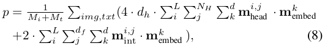

**2.2.4 Progressive Multi-Stage Distillation**
*"When attempting to achieve a high target sparsity, i.e.,>70%, compressing the model in a single stage can lead toa significant reduction in accuracy and even result in con-vergence failure. This is due to the fact that most weights ofthe large model are directly discarded, including those thatare important for ensuring model quality and convergence.As a solution, we propose a multi-stage progressive distil-lation method to achieve a high compression rate withoutseriously sacrificing accuracy. In each stage, we use a mod-est degree of compression, e.g., 25%, to avoid large loss ofperformance and make training stable."*

Just using the two precedent methods gradually, maybe changing also the percentage of compression. 

**2.2.5 Loss integration**
MobileClip distillation into TinyClip is a possibility, so two plausible Losses might be:

1. TinyClip
   $$
   L = L_{distill} + L_{sparsity}\\
   $$
2. Mixture of TinyClip and MobileClip
$$
\mathcal{L}_{\text{Total}}(\mathcal{B}) 
= (1 - \lambda)\,\mathcal{L}_{\text{CLIP}}(\mathcal{B})
  + \lambda((1 - \alpha)\mathcal{L}_{\text{Distill}}(\mathcal{B}) + \alpha\mathcal{L}_{\text{Sparsity}}(\mathcal{B}))   
$$

where:
- $\lambda$ balanced as usual the std. CLIP loss and the distillation one
- $\alpha$ instead balance the contribution of distill and sparsity
- $\mathcal{L}_{\text{Distill}}$ could be the MobileClip or the TinyClip loss, in both cases using the stored embeddings or the MobileClip embeddings
- $\mathcal{L}_{\text{Sparsity}}$ empowers the compression of the transformer architecture, eventually applied only to the self-attention layers in case of the hybrid transformer encoder and to the ConvFFN, FOR THIS APPROACH WE NEED TO KNOW THE WEIGHTS OF THE TEACHER MODEL, Which we don't have those in mobileClip standard training. -> **we need to distill even further mobileClip.**

## 2.3 Inference - PuMer
*Pumer Contributions*
### 2.3.1 TIP and MAM 
Inside a transformer architecture self-attention layers, we can use the keys of each token vector as a metric to understand the importance of each token. 

*"Each token reducer consists of two sequential non-parametric modules: first, a text-informed pruner (TIP) prunes image tokens that are not related to the accompanying text (Section 4.1); second, a modality-aware merger (MAM) reduces tokens by merging similar tokens within the image or text modality"*

**TIP:** taken as it's presented in the paper is not usable, cause CLIP doesn't have a shared transformer block layer where image and text tokens are mixed and consequently passed in a MHA layer.

**MAM:** We take the dot product between the keys of each token vector and the top scoring(the most similar) and merge them according to the merge ratio $\mathcal{r}$

$$
\mathcal{S_{p}^{t_1 t_2}} = \mathcal{K_{t_1}}\mathcal{K_{t_2}}
$$

with:
- $V$ image(text) token vectors
- $\mathcal{p}$ from [0 .. $\mathcal{k}^{'}$] where $k^{'}=(1 - k)|V|$ that is the number of kept token

### 2.4 Token Pruning through Patch Ranking for CLIP

*Published on: IEEE/CVF Winter Conference on Applications of Computer Vision (WACV), Tucson, 2024.*

*"In this work, we introduce a novel framework designed forpruning patch tokens in CLIP’s ViT, effectively addressing the computational intensity typically associated with thesemodels. At the heart of our approach is **the “Golden Ranking” concept**, which methodically ranks patch tokens basedon scoring functions. A key innovation in our method isthe **deployment of a lightweight predictor**, trained to closely approximate this Golden Ranking. Furthermore, to mitigatethe inevitable performance loss resulting from the pruningprocess, **we integrate learnable text and visual tokens intoour framework.** These tokens, especially visual tokens, wereshown to play a pivotal role in compensating for potential performance degradation, ensuring the model’s output remainsaccurate post-pruning. Our extensive experiments across avariety of datasets have demonstrated that our framework canachieve **a substantial reduction in patch tokens, by up to 40%in CLIP’s ViT**, while maintaining comparable performance(only 0.3% lower accuracy)."*

**2.4.1 Phase 1 - Identifying the pruning subset**
Inside the CLIP ViT, not all the patches identify for relevant information, so the idea is to find a **token subset** that is useless for the model through a ranking system formed by 3 different scores.

*"To bridge this gap, we introduce three scoring metrics designed to rank patch tokens based on their impact on CLIP’s predictions, forming what we term the ‘Golden Ranking‘."*

To do this, they apply a series of pruned tokens to the model and evaluate:

1. **Label-Driven Ranking Score** *"The pruned tokens T i are scored based on CLIP’s zero-shot posterior probability of assigning the pruned sequence $\mathcal{T_i}$ to the ground 33.2. Phase II: Predicting the Golden Ranking truth label $y_{gt}$"*
$$
s(\mathcal{T_i}) = \mathcal{P(\mathcal{y_gt}|\mathcal{X_{\mathcal{T^{¯}_i}}})}
$$
2. **Maximum Confidence Score** *"assess the pruned tokens T i based on the maximum confidence across all classes $y$."*
$$
s(\mathcal{T_i}) = \max_{y}\mathcal{P(y|X_{\mathcal{T^{¯}_i}})}
$$
3. **Feature Preservation Score** *"feature preservation seeks to identify the tokens that, when re- moved, do not alter the image representation, as ex- pressed by the CLS token embedding. This score is quantified using cosine similarity"*
$$
s(\mathcal{T_i}) = \frac{\mathcal{Z^{cls}}\mathcal{Z^{cls}_{\mathcal{T^{¯}_i}}}} {||\mathcal{Z^{cls}}|| ||\mathcal{Z^{cls}_{\mathcal{T^{¯}_i}}}||}
$$

Where Z cls denotes the CLS embedding obtained from the full sequence $\mathcal{X}$ and $\mathcal{Z^{cls}_{\mathcal{T^{¯}_i}}}$ denotes the embedding obtained with a pruned sequence.

*"Instead, we remove a larger r × r block of tokens, resulting in more noticeable changes. As the removal block T i slides over the image, each token is removed and assessed multiple times, thus stabilizing the final average score of each token t"*

$$
\mathcal{s(t)} = \frac{1}{|\mathcal{T_i}|} \sum_{i:t \epsilon \mathcal{T_i}} \mathcal{s(\mathcal{T_i})} 
$$

**2.4.2 Phase 2**
*"After establishing the Golden Ranking using one of the three metrics above, we train a lightweight predictor, $ŝ = h(Z; Θ) ∈ ℜ^N$ , to efficiently approximate it, and thus identify the least useful tokens from their representations Z."*

They now train a predictor to insert in the early layers of the ViT to prune a given number of tokens, this predictor tries to emulate the Golden Ranking scores

**2.4.3 Phase 3**
Prompt tuning (aka need some training) to compensate the pruning done in Phase2.
The prompt tuning is made by adding learnable prompts both at the beginning of the Visual encoder and Text encoder, where they are correlated by a linear transformation described by:
$\mathcal{P_v^i = MP_t^i}$

**2.4.4 Possible Integrations**
1. Adding to the trained MobileClip -> to understand if is possible in the middle layers
2. Loss integration in the sparsity loss -> during training, every n batches we prune some tokens and compute the scores. **What would be the upgrades?**

---

# OLD

 Reinforloss function
- synthetic captions
	- CoCa [74] -> due nozioni su questo
- significato di strong teacher in un ensemble teacher

- architettura di mobile clip
	- structura reparametrizatoin in image and text encoders -> spiegare bene cosa hanno fatto 
	- Text-RepMixer (guarda 2.2.1 nel nostro MobileClip)
		- come funziona
		- cosa sono i filtering networks [16]?
		- e' basato su RepMixer
			- come funziona?
		- migliorie rispetto RepMixer
		-  **hybrid text encoder(Conv/Transf) which makes use of 1-D convolutions and self-attention layers**: _Text-RepMixer_ which decouples train-time and inference-time architectures.
			- Decouple train-time and inference-time -> HOW?
		- implementation
		- Appendice E
	- MCi
		- based on FastViT [62]
		- guarda il 2.2.2
		- guarda appendice A

- PuMer (token pruning and merging)
- TinyClip
	- vedere la loss e come si potrebbe integrare