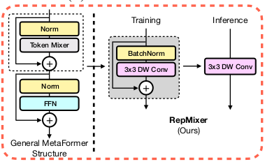
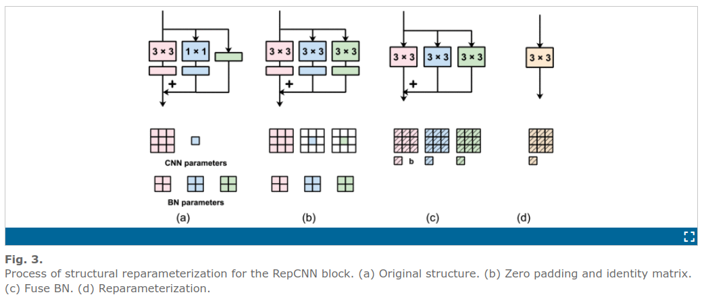
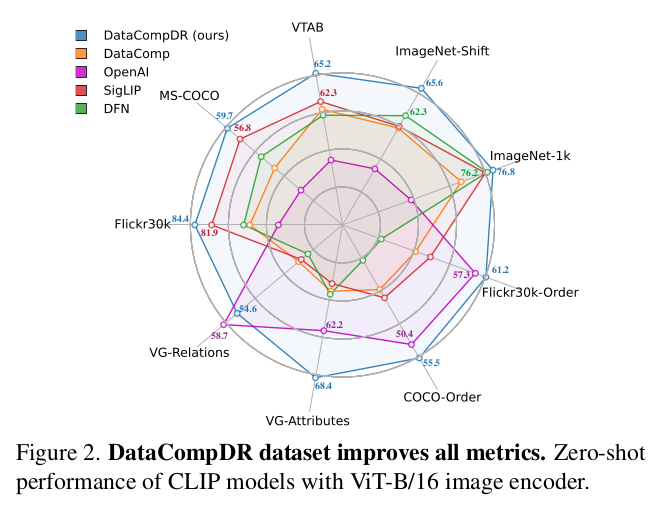
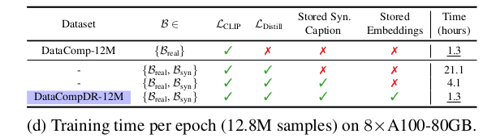

## Maybe useful citations
[3] PruMer: Pruning and Merging tokens in ViLT to reduce training complexity mantaining high accuracy.
[12]? Transformers for recognition at scale
[68] cross model affinity mimicking
[33,46] unimodal model ensembilnd; multimodal setup > utile per capire bene come hanno fatto l'ensemble
[74] IMPORTANTE: CoCa, il modello usato per fare le caption sintetiche
[62] fastvit e' da vedere come funziona, FATTO
[61] forse dare uno sguardo
[18] (scaricato) Datacomp: In search of the next generation of multimodal datasets -- il dataset usato come base per creare il loro dataset rinforzato
[14] Reinforce Data
[47] (scaricato) **CLIP paper** Learning Transferable Visual Models From Natural Language Supervision -- standard multi-modal contrastive learning -- usato come esempio negativo: *at small-scale results in poor accuracies, which do not provide a useful signal to guide architecture design choices*.

Cos'e' model distillation? Tecnica di transfer learning, ci sono vari modi per farlo, qui hanno fatto un dataset reinforcement salvando tra le cose anche gli embeddings dell'ensembling di strong CLIP, e poi hanno trainato dei modelli più piccoli cercando di riprodurre gli embeddings salvati per ogni sample.

[[xopp/2311.17049_mobile_clip.pdf|2311.17049_mobile_clip]]
OpenAI ViT-B/16 CLIP

---------------------
# Mobile CLIP 
### *Fast Image-Text Models through Multi-Modal Reinforced Training*
## 1. In a nutshell
### 1.1 Goal
- design a new family of aligned image-text encoders suitable for mobile devices.
### 1.2 Challenges (to solve this problem)
1. **Tradeoff beween runtime performance and accuracy of different architectures.**
	- large scale training of CLIP models is computationally expensive, so rapid devop and exploration of efficient architecture design is hard
	- standard multi-model contrastive learning [47] at small-scale results in poor accuracies, which doesn't provide a useful signal to guide architecture design choices
2. **Reduced capacity of smaller architectures leads to subpar accuracy; can be improved with a better training method.** (Missing reference, probably CLIP paper [47])
### 1.3 Overview - What they did 
A novel training approach based on the **dataset reinforcement method** [14] :
1. reinforce the dataset once with additional information
2. use the reinforced dataset several times for experimentation
results in improved accuracy wrt original dataset.

#### Propose:
1. **multi-model variant of dataset reinforcement for training efficient CLIP models.**
	- reinforced dataset
	- training architecture, for training they mean...
1. **model design**
	- text encoder: *Text-RepMixer*: convolutional token mixer that decouples train-time and inference-time architectures.
	- image encoder: oved hybrid vision transformer called MCi based on the recent FastViT
  	
	**Figure 1: Text-RepMixer**

	

### 1.4 What they achieve
Citing the paper abstract...

*Our MobileCLIP-S2 variant is **2.3× faster while more accurate** compared to previous best CLIP model based on ViT-B/16.*

*We further demonstrate the effectiveness of our multi-modal reinforced training by training a CLIP model based on ViT-B/16 image backbone and achieving **+2.9% average performance improvement on 38 evaluation benchmarks compared to the previous best.** Moreover, we show that the proposed approach achieves **10×-1000× improved learning efficiency** when **compared with non-reinforced** CLIP training.*

So:
1. better avg. accuracy on 38 benchmarks
2. improved learning efficency

## 2. In detail
#### Training Architecture: Multi-modal reinforced training
We introduce multi-modal reinforced training, a novel training strategy that incorporates knowledge transfer from a pre-trained image captioning model and an ensemble of strong CLIP models to improve learning efficiency.

Our proposed multi-modal reinforced training also includes: 
1. **cross-modal affinity mimicking** [68 ]
2. **extend uni-modal model ensembling** to multimodal setup [33, 46]
3. **store targets obtained from an ensemble of CLIP models**
4. **we extend the dataset reinforcement strategy** to the multi-modal setup [14 ]
 

Our proposed reinforced multi-modal datasets, result in **significant accuracy improvement** without adding a training-time computational overhead.

### 2.1 Reinforced Training

#### 2.1.1 Training
Training, leverages knowledge transfer two main components: 
1. leveraging the knowledge of an image captioning model via **synthetic captions**
2. knowledge distillation of image-text alignments from an ensemble of strong pretrained CLIP models **through the dataset reinforcement strategy.** We store the additional knowledge (synthetic captions and teacher embeddings) in the "reiforced" dataset (see Fig. 3)

##### Loss Function
take a look at the paper, too long to copy it here now.

##### Efficient Training
For every sample, we read the image $x_{img}^{(i)}$ and the corresponding ground-truth caption $x^{(i)}_{txt}$ form the dataset.
Then we randomly load one of stored augmentation parameters $a^{(i,j)}$ and reproduce the augmented image $\hat{x}^{(i,j)}_{img}$ . We also randomly load one of synthetic captions $x_{syn}^{(i,s)}$. Finally we read the stored embeddings $\psi_{img}^{(i,j,k)}$, $\psi_{syn}^{(i,s,k)}$ and $\psi_{txt}^{(i,k)}$, corresponding to the *K* teacher models.
Using this data we construct two data batches:
- $\mathcal{B}_{real}$ augmented image, real caption pairs
- $\mathcal{B}_{syn}$ augmented image, synthetic caption pairs
and compute our trainig loss separately on both. The final loss is:
$$\sum_{\mathcal{B} \in \{\mathcal{B}_{real}, \mathcal{B}_{syn}\}} \mathcal{L}_{Total}(\mathcal{B})$$
Note that we can compute the total loss after a forward pass of the student model without any extra teacher related computations since the teacher embeddings required to compute the distillation loss are readily available as part of the dataset.

#### 2.1.2 Dataset Reinforcement

Reinforce [14] the image-text DataComp [18] adding sysnthetic captions and embedding from a strong ensemble of pretrained CLIP models (From table 12):
- teacher 1: `openai-ViT-L-14`
- teacher 2: `datacomp_xl_s13b_b90k-ViT-L-14`

"We picked the ensemble of two ViT-L-14-based CLIP models as the teacher model (highlighted in blue) in our dataset reinforcement process." - **See table 14**

Two variants of the datasets:
- DataCompDR-12M
- DataCompDR-1B
Shows significant learning efficiency improvement.

We introduce two variants of our reinforced datasets: DataCompDR-12M and DataCompDR-1B. Using Data- CompDR, we demonstrate 10x-1000x learning efficiency in comparison to DataComp.

Our proposed reinforced multi-modal dataset also benefits from synthetically generated captions, which we show are crucial for improved learning efficiency.

##### Synthetic captions - Aka Caption Augmentation
Motivation: image-text datasets used to train CLIP models are mostly sourced from the web, which is noisy. DataComp [18] and data filtering networks [16] improved the quality, but captions may not be descriptive enoiugh.

In order to boost the visual descriptiveness of caption we use CoCa [74] model and generate multiple synthetic captions for each image. $\rightarrow$ real captions in comparison to synthetic captions are generally more specific but noisier.

##### Image Augmentation
For each image $x_{img}^{(i)}$, we generate multiple augmented images $\hat{x}_{img}^{(i)}$ using a parmetrized augmentation function $\mathcal{A}$  
$$\hat{x}_{img}^{(i,j)} = \mathcal{A}(x_{img}^{(i)}; a^{(i,j)})$$
where $a^{(i,j)}$ are the augmentation parameters that are sufficient to reproduce $\hat{x}_{img}^{(i)}$ from $x_{img}^{(i)}$. 
The number and different kind of augmentations are provided in Tabs 4a and 13. 

Using coca_ViT-L-14 in OpenCLIP and strong random image augmentation
- DataCompDR-12M: 30
- DataCompDR-1B: 10
##### Ensemble Teacher
Model ensembling is used to create a stronger model froma set of indipendently trained ones [33,46]. We extend this technique to multi-model setup and use an ensemble of *K* CLIP models as a strong teacher.

We compute the feature embeddings of these models for augmented images $\hat{x}^{(i,j)}_{img}$ and synthetic captions $x^{(i,s)}_{syn}$ obtaining $d_k$-dimensional vectors $\psi^{(i,j,k)}_{img}$ and $\psi^{(i,s,k)}_{syn}$ for the $k_{th}$ teacher model. We also compute the teacher embeddings $\psi^{(i,k)}_{txt}$ of the ground-truth captions $x^{(i)}_{txt}$ (see Fig. 3b).

##### Reinforced Dataset
We store the image augmentation parameters a (i,j) , synthetic captions $x^{(i,s)}_{syn}$ , feature embeddings  $\psi^{(i,j,k)}_{img}$ , $\psi^{(i,s,k)}_{syn}$ and $\psi^{(i,k)}_{txt}$ of the CLIP teachers as additional knowledge in the dataset along with the original image $x^{(i)}_{img}$ and caption $x^{(i)}_{txt}$ (see Fig. 3c).

### 2.2 Model Architecture
Using DataCompDR a new family of mobile-friendly aligned image-text encoders called MobileCLIP was developed, with a better latency-accuracy tradeoff compared to the previous works.

Variants of MobileCLIP use hybrid CNN/transformer architectures with **structural reparametrization in image and text encoders** to reduce the size and latency.  

*"We also introduced an improved convolution-transformer hybrid architecture for both vision and text modalities, that improve over recent state-of-the-art like [ 22, 38 , 44 , 53 ]."*

#### 2.2.1 Text Encoder | Text-RepMixer
In classic CLIP is paired the vision transformer with a classical transformer with self-attention layers for text encoding; this works well but it's not efficient.
- Recent work [67] showed that **convolutions can be as effective for text encoding** but we found that purely convolutional architectures underperform their transformer counterparts.
- We introduce a **hybrid text encoder(Conv/Transf) which makes use of 1-D convolutions and self-attention layers**: *Text-RepMixer* which decouples train-time and inference-time architectures.
- Inspured by reparametrizable convolutional token mixing (RepMixer, introduced in [62]). More in the paper and Appendix F.

#### Text-RepMixer vs RepMixer
*Text-RepMixer*

 

*RepMixer*

**This encoder is smaller, faster and has similar performance as the base text encoder paired with ViT-S/16.**

##### Hybrid Implementation
1. Ablation on the convolutional text encoder with 6-layers, 11 size kernel was the best tradeoff
2. Use depth-wise 2D convolutional layers(for efficency)
3. Reshaping of the 3d input tensor in to the *BC1S* standard
4. "The FFN layers enable interactions between token's channel dimensions. Since the convolution layer is 2D, we simply reuse the reparameterization process described in [62]"

#### 2.2.2 Image Encoder | MCi(i = 0,1,2)
For Mobile-CLIP we introduce an improved hybrid vision transformer called MCi based on the recent FastViT [62].
To improve parameter efficiency we lower the expansion ration to 3.0 and increase the depth of the architecture. More in Appendix A.

---
##### FastVit
FastViT is a hybrid transformer and has **4 distinct stages** which operate at different scales, plus a stem head for processing raw embeddings of the input.

The main introductions were:
1. use of RepMixer block to remove skip connections
2. use of linear train-time overparameterization to improve accuracy
3. use of large convolutional kernels to substitute self-attention layers in early stages
   
The first 3 are the same stacked on top of each other, with no attention mechanism but RepMixer as token mixing component which is faster and emulates the behavior of a classic ViT.
While in the forth is done the CPE (which will be overparametrize in the training) and there is the attention mechanism.

**CPE:** *Conditional Positional Encoding* which instead of relying on fixed positional vectors, CPEs adjust the positional encoding vectors in response to the specific context of the input, enabling more flexible and context-aware representations.

**RepMixer:** Is a **convolutional mixing**(not with self attention like classical token mixing) that differentiate between training and inference time by doing:
- *Training*: a simple DepthWise Convolution  with BN and skip connection
- *Inference*: they leave skip connection and everything is represented just with a DepthWise Convolution which incorporate the previous skip. This is called **structural reparameterization**

 

*Stage 1-2-3*

*Stage 4*

*ConvFFN*

--- 
#### Further Improvements
*"The optimizations introduced in [3 , 68 ] can be used to further improve efficiency of our models."*

- [3] PuMer (tokens pruning and merging): here is introduced a method for pruning and merging tokens inside a (pre-trained) ViLT, improving model inference speed and reducing memory footprint.  
TIP stands for *text-informed pruner* while MAM stands for *modality-aware merger*.

	**TIP:** prune image tokens that have low correlation with the accompanying text. This is done using the scores produced by the attention modules already present in the net, thanks to this, **there is no parameter learning involved in the process.**

	**MAM:** merge image tokens that have meaning but are redundant (this process is done after pruning), this is done using the same principle as TIP and the formula used is just the dot product between the similarity scores:
		
	*"Since the self-attention in a VL model layer already has computed keys and values for each token to measure similarity, following Bolya et al. (2022), we compute the similarity as the dot product 
	$S^{t1t2} =  K^{t1} K^{t2}$
	between the keys of each token vector X i . We keep the rest non-top-r ' to- kens in O rest and unmerged tokens in E rest ."* 

	previous approaches:
    - *DynamicViT:* token pruning through a MLP net specialized
    - *ToMe:* token merging, after the attention module, they took the Key values of each token and do dot product similarity. Then through an iterative process, they merge tokens patches that are most similar, keeping an *r* max number.(no parameter learning)
    - *Smaller Resolution:* We downsample the input image to smaller resolutions and finetune the VL models. Using smaller input images directly reduces the computation of VL models.

- [68] TinyClip: 
	- We propose a new cross-modal distillation approach to unleash the capacity of small CLIP models, is a distillation loss together with the CLIP contrastive loss.
  
	
#### 2.2.3 Architectural design techniques

##### Structural Reparametrization
This technique consist to have different architectures between train and inference time, removing all the skip connections and having a much simpler structure at inference time permits to keep the knowledge from the specific block while reducing notably the latency during inference.

This is done in this specific case collapsing every skip connection and every other operations in a single depth wise convolutional block.

*From RepMobile*

##### Convolutional Token Mixing
Inside a transformer, instead of using a classical self attention mechanism during the token mixing part, it has been shown that similar results could be achieved especially in the first blocks of the transformer using the convolutional counter part but speeding up latency and training wise.

TextRep-Mixer is an example of that.

## 3 Test and Results

### 3.1 Results
#### 3.1.1 Latency

#### 3.1.2 Accuracy

### 3.2 Test

On *DataCompDR-12M*:

- **With the stored embeddings ==> 4.1 hours**
- **Without the stored embeddings ==> 1.3 hours**
