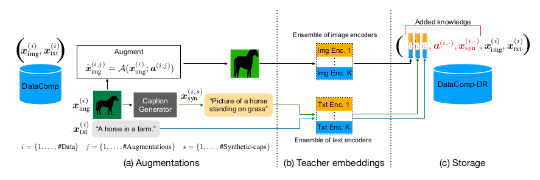
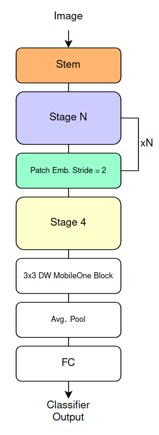

# AdvancedCV project - MobileCLIP 

# 1. Overview

MobileCLIP is a family of **aligned image-text encoders** designed for **mobile devices**, focusing on **small size**, **low latency**, and **competitive accuracy**. Traditional CLIP models often require large-scale training and inference resources.

MobileCLIP tackles these challenges by:
1. **Creating a Reinforced Dataset**, designed for training compact CLIP models using transfer learning techniques. --> *DataCompDR*
2. **Proposing a new training approach called multi-modal reinforced training**, where additional information (e.g., synthetic captions and teacher embeddings) is incorporated into the reinforced dataset (described before) to accelerate and guide the learning process. --> *Distillation Loss*
3. **Developing hybrid CNN-transformer architectures** (for both image and text encoders) that use **structural reparametrization** to reduce model size and boost inference speed. --> *Text-RepMixer*  
4. Demonstrating **state-of-the-art latency-accuracy tradeoffs**: for instance, variants of MobileCLIP can be significantly faster than ViT-B/16-based CLIP models while matching or surpassing their accuracy. --> *MobileCLIP-S2*

# 2. Fundamentals

This section describes the underlying concepts, that power the MobileCLIP approach.

## 2.1 Multi-Modal Reinforced Training and Dataset Reinforcement

### 2.1.1 Motivation
- **Small-scale training of CLIP** typically results in poor accuracies, giving little guidance for efficient architecture design.  
- **Smaller models** (targeted for mobile) lose representational capacity compared to large-scale CLIP, leading to reduced performance.  

### 2.1.2 Reinforced Dataset
MobileCLIP’s training relies on **DataComp** as the base dataset, extended into **DataCompDR** (reinforced versions). Two variants—**DataCompDR-12M** and **DataCompDR-1B**—demonstrate better learning efficiency vs. the non-reinforced original. Key reinforcements include:

1. **Synthetic Captions**  
   - Generated using a pre-trained **CoCa** (e.g., `coca_ViT-L-14`) model to enrich each image with multiple, more descriptive text captions.  

2. **Stored Teacher Embeddings**  
   - An **ensemble of strong CLIP models** (e.g., `openai-ViT-L-14` plus `datacomp_xl_s13b_b90k-ViT-L-14`) pre-computes embeddings for both images and captions (real and synthetic).  
   - These teacher embeddings guide the smaller model, offering knowledge distillation during training without adding computational overhead for teacher forward passes at training time.  

3. **Image Augmentation Metadata**  
   - For each image, diverse augmentation parameters (crop, RandAugment, RangeAugment, etc.) are stored. This allows the model to re-create augmented views of the original image on demand, further enriching training signals.

   

   

   

   

   *MobileCLIP dataset reinforcement process*

   

### 2.1.3 Multi-Model Knowledge Transfer
With all teacher embeddings pre-stored, a **distillation loss** aligns the student model’s embeddings to the teacher ensemble’s embeddings.

The loss is computed on **two different batches** of samples:
$$\sum_{\mathcal{B} \in \{\mathcal{B}_{real}, \mathcal{B}_{syn}\}} \mathcal{L}_{Total}(\mathcal{B})$$

Where:
- $\mathcal{B}_{real}$ : augmented image, real caption pairs batch
- $\mathcal{B}_{syn}$ : augmented image, synthetic caption pairs batch

The batches are created by randomly choosing **one augmentation** and **one syntethic sample** for each real image in the batch from the reinforced dataset.

MobileCLIP total training loss combines:
1. $\mathcal{L}_{CLIP}$ : **Standard CLIP Contrastive Loss**   
2. $\mathcal{L}_{Distill}$ : **Distillation Loss** (Kullback-Leibler or similar) that mimics teacher alignment. 

By randomly pairing **real** captions, **synthetic** captions, and their respective teacher embeddings, the model learns more robust image-text alignment.

**Losses Formulas**

$$\mathcal{L}_{Total}(\mathcal{B}) = (1-\lambda) \mathcal{L}_{CLIP}(\mathcal{B}) + \lambda \mathcal{L}_{Distill}(\mathcal{B})$$

*Total loss*

$$\mathcal{L}_{Distill}(\mathcal{B}) = \frac{1}{2} \mathcal{L}^{I2T}_{Distill}(\mathcal{B}) + \frac{1}{2}\mathcal{L}^{T2I}_{Distill}(\mathcal{B})$$

*(total) Distillation Loss*

$$\mathcal{L}_{Distill}^{I2T} = \frac{1}{bK} \sum_{k=1}^{K}KL(\mathcal{S}_{\tau_k}(\Psi^{(k)}_{img}, \Psi^{(k)}_{txt}) || \mathcal{S}_{\hat(\tau)}(\Phi_{img}, \Phi_{txt}))$$

*Distillation Loss*

Where:
- $\lambda$ : is a tradeoff parameter
- $\mathcal{L}_{Distill}^{T2I}$  : is computed by swalpping the text and image embedding terms of $\mathcal{L}_{Distill}^{I2T}$
- $K$ : number of teacher models in the ensemble 
- $KL$ : is the Kullback-Leibler divergence
- $\mathcal{S}$ : similarity matrix obtained by applying row-wise Softmax operation with $\tau$ temperature parameter  
- $\psi^{(i,j,k)}_{img}$, $\psi^{(i,s,k)}_{syn}$, $\psi^{(i,k)}_{txt}$ : stored feature embeddings respectively for image, syntethic and real captions  
- $\Phi_{img}, \Phi_{txt}$ : image and text embedding matrices of the target model
## 2.2 Model Architecture

### 2.2.1 Hybrid Text Encoder — Text-RepMixer
- **Goal**: replace the classical transformer in CLIP’s text encoder (which uses attention-based token mixing) with a more **latency-friendly** yet accurate architecture.  
- **Approach**: a **hybrid convolution/transformer** design that uses **1-D depthwise convolutions** for token mixing (inspired by **RepMixer**), plus structural reparametrization so that *train-time skip connections* collapse into a single efficient layer at inference.  
- **Outcome**: smaller, faster text encoder with accuracy on par with the standard text transformer of a ViT-S/16-based CLIP.

   

   

   
   *RepMixer*
   
   

   

   

   
   *Text-RepMixer*
   
   

### 2.2.2 Hybrid Image Encoder — MCi (Based on FastViT)

   

   - **Goal**: have an **accurate image encoder** with **smaller size** than others comparable architectures, to achieve **low latency** during the inference phase.
   - **Approach**: implement **MCi**, a hybrid vision transformer based on **FastViT**,  featuring **convolutional token mixing** (RepMixer blocks) in the early stages, plus a final stage with **self-attention** and **conditional positional encoding** (CPE). 
     - **MCi** is a modification for MobileCLIP of **FastViT** by reducing the **expansion ratio** and slightly increase depth, balancing parameter count and performance.
   - **Outcome**: faster image encoder rather than **FastViT** (FastViT-MA36) and overall more accurate CLIP average zero-shot accuracy.  

   

   

      
   
   *FastVit Architecture* 

   

#### Why Convolutional Mixing?
- Early transformer layers often spend most of their capacity mixing local features; **convolution-based mixing** can be faster while retaining expressive power.  
- **Reparametrizable** blocks (train vs. inference) yield simpler final inference graphs, drastically reducing latency.

## 2.3 Training Flow
MobileCLIP training by design doesn't require to load the teachers ensemble and inference the embeddings for each new batch presented. Therefore the training  results in a faster and more computionally and memory efficient process, compared to other state of the art approaches.

Here a brief explanation of the training flow:
1. **Data Loading**  
   - Real images + ground-truth captions.  
   - Synthetic captions (optionally).  
   - Pre-stored teacher embeddings for image and text.  
   - Augmentation parameters for each sample.  

2. **Batches Creation**  
   - $\mathcal{B}_{\mathrm{real}}$: augmented real image + real caption.  
   - $\mathcal{B}_{\mathrm{syn}}$: augmented real image + synthetic caption.  

3. **Loss Computation**  
   - Contrastive CLIP-like loss on real pairs and synthetic pairs.  
   - **Distillation**: compare student embeddings to teacher embeddings.  

4. **Inference**  
   - The reparametrized (skip-connection-free) encoders offer **faster, lighter** forward passes for mobile scenarios.

# 3. Possible Improvements

Below are research directions and ideas that can further refine or extend MobileCLIP.

## 3.1 More Advanced Distillation & Compression

### TinyCLIP-style Distillation  
  - TinyCLIP employs a **cross-modal affinity mimicking** approach to train smaller CLIP models. It also features **weight inheritance and learnable masks** for high compression ratios.
   
   

      

   
   
   

      

      <b>No Teacher Available</b>
      <ul>
      <li>The reinforced dataset contains the target embeddings consequentely <b>there are no weights to inherit</b></li>
   </ul>
   

   

  - Distill MobileCLIP’s knowledge with TinyCLIP could lead to a more compact student.
  
  

      

   
   
   

      

      <b>Underfitting</b>
      <ul>
      <li>The process still <b>require to keep both the teacher and student</b> model to inherit the weights</li>
      <li>Reducing the model through different transfer learning iterations could drastically reduce performance</li>
   </ul>
   

   

## 3.2 Token Pruning and Merging for faster inference

### PuMer-Style Techniques (Pruning + Merging) 
PuMer combines  **text-informed pruner (TIP)** and **Modality-Aware Merger (MAM)** for reducing the token number in the cross-modal encoder block in ViLT.
Both mechanisms use a smilarity measure between the keys of each token vector, **which is possible only if we have attention layers inside our architecture.**  
  - **TIP** discards image tokens minimally relevant to the caption.  
  - **Modality-Aware Merger (MAM)** then merges remaining tokens that are highly similar, reducing the token count further.  

      

   
   
   

      

      <b>Different Architecture</b>
      <ul>
      <li>CLIP models doesn't have the cross-modal transformer encoder, so the similarity measures couldn't be computed between text and image tokens. <b>TIP is not a valid approach</b></li>
      <li>Reducing the already low number of tokens could improve the inference speed but might reduce significantly the model accuracy</li>
   </ul>
   

   

      

   
   
   

      

      <b>MAM application</b>
      <ul>
      <li>Although PuMer was introduced for ViLT, similar strategies could be adapted for MobileCLIP's hybrid architecture to reduce computation on the image side through like <b>Modality-Aware Merging</b>.</li>
   </ul>
   

   

### Patch Ranking Pruning  
  - Another approach ranks patch tokens by various scoring functions (confidence scores, label-driven scores, or feature preservation).  
  - Training a lightweight predictor can approximate these “Golden Rankings” and remove the least useful tokens on the fly.

   *Patch Ranking Problems*
## 3.3 Other Potential Ideas

- **Data-Centric Enhancements**  
  - Further refine the reinforcement process by stacking more advanced caption generation or refining teacher ensembles with specialized domain experts.  
- **Dynamic Input Resolution**  
  - Adjust input resolution on a per-sample basis: low-resolution inference for simpler images, high-resolution for more complex ones.  

By combining some or all of these strategies—robust reinforcement, advanced distillation, and sophisticated token pruning—future versions of MobileCLIP can achieve even higher efficiency and performance on resource-limited devices.

# 4. References

## Contributors
- [Ettore Saggiorato](https://github.com/sa1g)

- [Emanuele Poiana](https://github.com/IlPoiana)

# 5. Additional Material

In this section are present links to concepts that are at the basis of the work explained in this document

CLIP
TinyClip
PuMer
Patch Ranking
Sigmoid Attention Layer
Synthetic Captioning and Image augmentation